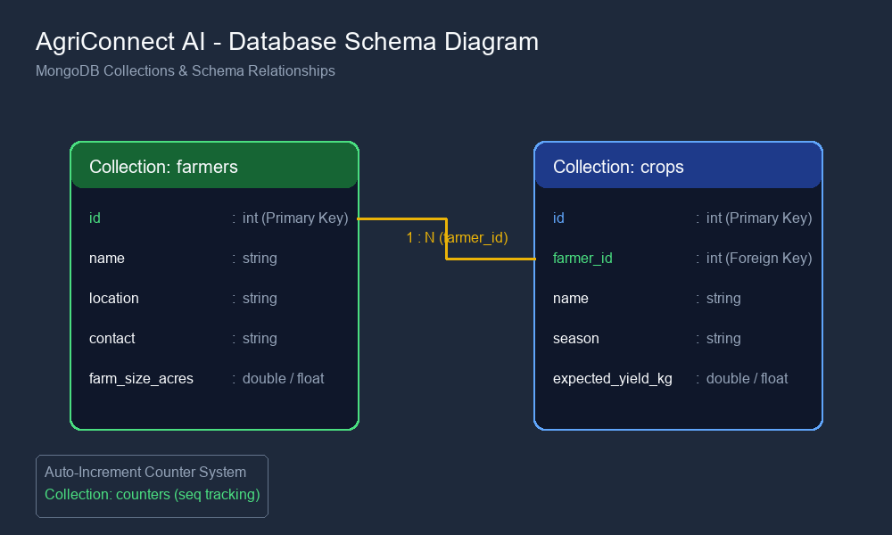

# AgriConnect AI – Smart Agriculture Management Platform

## Overview

AgriConnect AI is an AI-powered web platform developed for farmers and agricultural cooperatives. It simplifies farm management by providing tools for farmer registration, crop management, weather monitoring, and AI-powered agricultural recommendations. The platform combines a modern React frontend with a FastAPI backend and integrates Google Gemini AI to deliver intelligent farming assistance.

---

## Features

* Farmer Management System
* Crop Management
* Weather Monitoring
* AI Farm Advisor
* Crop Disease Detection & Prevention
* Analytics Dashboard
* Responsive User Interface
* REST API Backend

---

## Tech Stack

### Frontend

* React
* Vite
* Tailwind CSS
* React Router

### Backend

* FastAPI
* Uvicorn

### Database

* MongoDB Atlas (Integrated)

### Authentication

* JWT Authentication *(planned)*

### AI

* Google Gemini API *(planned)*

### Deployment

* Vercel (Frontend)
* Render (Backend)

---

## Project Structure

```text
agriconnect-ai/
│
├── frontend/
│   ├── src/
│   ├── public/
│   └── package.json
│
├── backend/
│   ├── routes/
│   ├── models/
│   ├── services/
│   ├── database/
│   ├── main.py
│   └── requirements.txt
│
└── README.md
```

---

## Getting Started

### Prerequisites

Make sure you have installed:

* Python 3.11+
* Node.js 18+
* npm
* Git

---

# Backend Setup

Navigate to the backend folder.

```bash
cd backend
```

Create a virtual environment.

```bash
python -m venv venv
```

Activate the virtual environment.

**Windows (PowerShell)**

```bash
.\venv\Scripts\Activate.ps1
```

**Windows (CMD)**

```bash
venv\Scripts\activate
```

**Linux / macOS**

```bash
source venv/bin/activate
```

Install dependencies.

```bash
pip install -r requirements.txt
```

Run the FastAPI server.

```bash
uvicorn main:app --reload
```

Backend runs at

```text
http://127.0.0.1:8000
```

Swagger Documentation

```text
http://127.0.0.1:8000/docs
```

## Database Setup & Configuration

This project integrates with a remote **MongoDB Atlas** database cluster.

### Setup Instructions
1. Create a free cluster on MongoDB Atlas (M0 Shared Tier).
2. Create a Database User with read and write access.
3. Whitelist your IP address (or `0.0.0.0/0` for universal development access) under Network Access.
4. Copy the connection string.
5. Create a `.env` file in the `backend/` directory by copying `.env.example`:
   ```bash
   cp backend/.env.example backend/.env
   ```
6. Paste your MongoDB connection string as `MONGO_URI` and define `DATABASE_NAME=agriconnect_db`.

### Database Choice Rationale
For Week 5, we integrated **MongoDB Atlas** as the database:
- **FastAPI / Python Compatibility**: Mongoose is a Node.js-only ODM. For a Python-based FastAPI backend, `pymongo` is the native and most optimized MongoDB library.
- **Flexible Schema Structure**: Agricultural data (weather updates, crop yields, sensor profiles) is highly variable. Document-based collections perfectly match the dynamically generated mock structures.
- **Pydantic Model Mapping**: PyMongo integrates seamlessly with Pydantic schemas (`FarmerResponse`, `CropResponse`), enabling robust data validation without the overhead of heavy ODM layers.
- **Auto-Increment Counters**: Since the existing frontend and relationships relied on integer keys (IDs), we implemented an atomic auto-increment counter engine using a dedicated `counters` collection.

## Database Schema Diagram
Below is the visual representation of our database collections, fields, data types, and references:



---

# Frontend Setup

Open another terminal.

```bash
cd frontend
```

Install dependencies.

```bash
npm install
```

Run the development server.

```bash
npm run dev
```

Frontend runs at

```text
http://localhost:5173
```

---

## Available API Endpoints

| Method | Endpoint      | Description         |
| ------ | ------------- | ------------------- |
| GET    | /             | Home Endpoint       |    
| GET    | /api/farmers/ | Get All Farmers     |
| POST   | /api/farmers/ | Add Farmer          |
| GET    | /api/crops/   | Get All Crops       |
| POST   | /api/crops/   | Add Crop            |
| GET    | /api/weather/ | Weather Information |
| POST   | /api/ai/      | AI Farm Advisor     |

---

## Current Development Progress

### Completed

* React + Vite project setup
* Tailwind CSS integration
* Responsive UI components
* Light/Dark Theme
* Component Library
* React Routing
* FastAPI backend
* Farmer API
* Crop API
* Weather API
* AI API structure
* Frontend–Backend integration
* Dashboard consuming backend APIs
* MongoDB Atlas Database Integration (Week 5 CRUD persistence)
* Frontend "Edit Farmer Details" (Full CRUD integration)

### In Progress

* JWT Authentication
* Google Gemini AI integration
* Crop Disease Detection
* Deployment

---

## Author

**Kunwar Kapil Singh Karki**

B.Tech Computer Science

Graphic Era Hill University

SIP 2026 – AI-Assisted Full Stack Web Development

---

## License

This project is developed for educational purposes as part of the SIP 2026 Internship Program.
