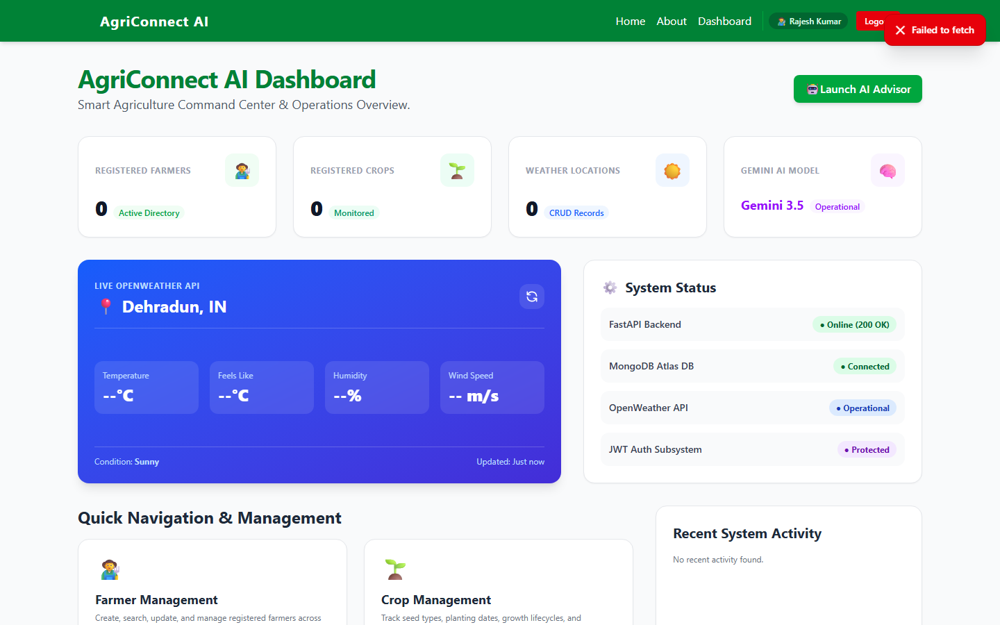
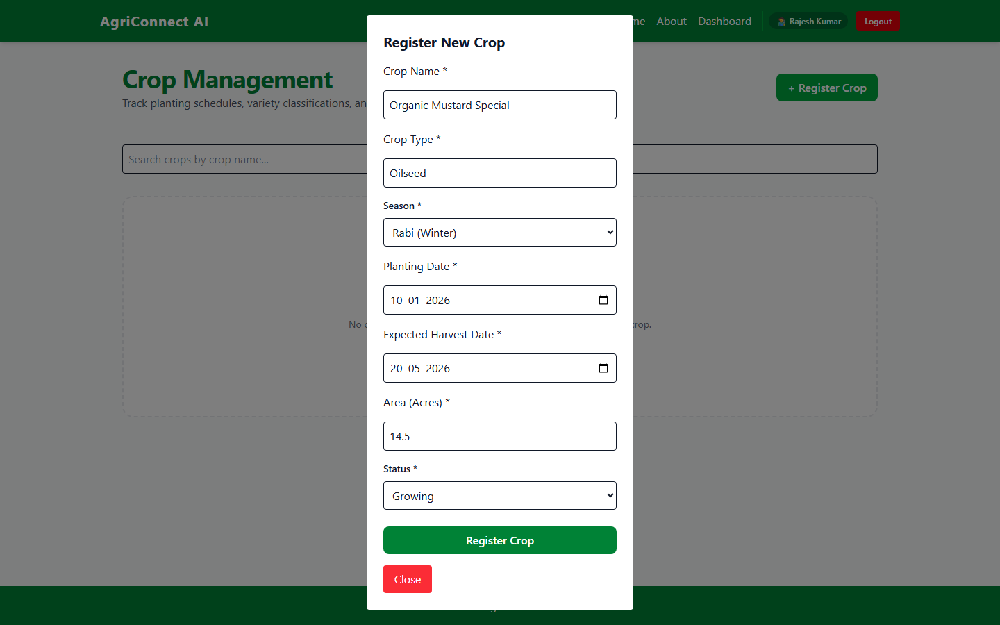
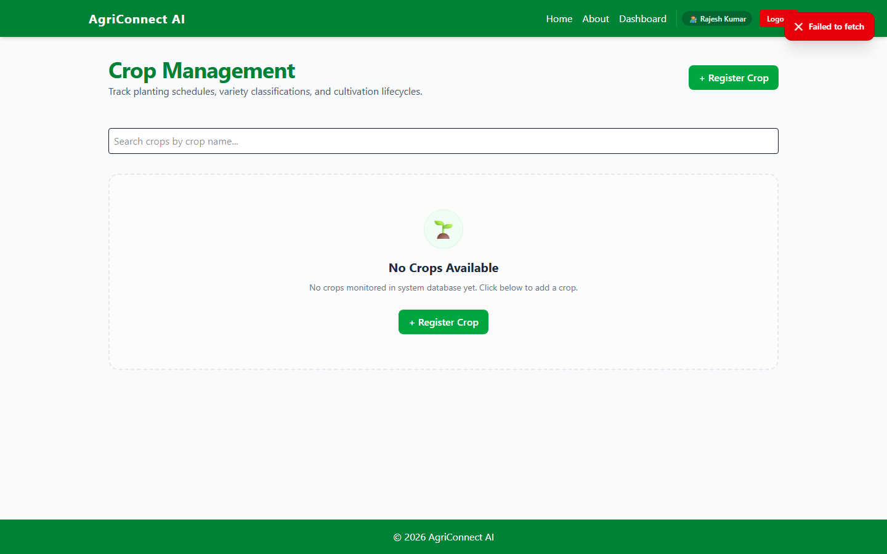
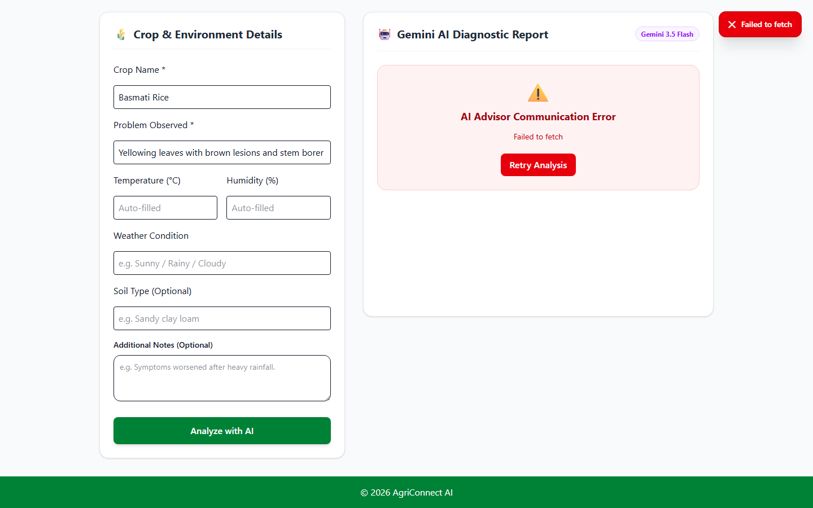

# 🌾 AgriConnect AI

An AI-powered smart agriculture management platform designed to help farmers and agricultural organizations monitor live weather, manage crop and farmer records, and obtain real-time intelligent crop health recommendations using Google Gemini AI.

---

## 🔗 Live Demo

- **Frontend Application (Vercel):** [https://agriconnect-ai-gamma.vercel.app](https://agriconnect-ai-gamma.vercel.app)
- **Backend API (Render):** [https://agriconnect-ai-backend.onrender.com](https://agriconnect-ai-backend.onrender.com)
- **Interactive API Docs (Swagger):** [https://agriconnect-ai-backend.onrender.com/docs](https://agriconnect-ai-backend.onrender.com/docs)

---

## 📸 Screenshots

| Key Screen | Preview |
| :--- | :--- |
| **Dashboard & System Health** |  |
| **Farmer & Crop Management** |  |
| **Update & Delete Records** |  |
| **AI Farm Advisor** |  |

---

## ⚡ Features

- **🔐 User Authentication & Authorization**
  - User registration and login with JWT (JSON Web Tokens) stateless authentication.
  - Password security using `bcrypt` password hashing.
  - Protected frontend routes and API middleware checks.

- **👨‍🌾 Farmer Management**
  - Full CRUD operations to create, read, update, and delete farmer profiles.
  - Tracking of farmer name, location/region, contact details, and farm acreage size.

- **🌱 Crop Tracking**
  - Real-time inventory and lifecycle management for active crops.
  - Data validation for crop types, growth status, and planting schedules.

- **🌦 Live Weather Monitoring**
  - Live weather data integration using the OpenWeather API (temperature, humidity, wind speed, pressure, weather conditions, and icons).
  - Historical weather record tracking with CRUD capability.

- **🤖 AI Farm Advisor (Powered by Google Gemini AI)**
  - Context-aware diagnostic advisory engine utilizing `gemini-3.5-flash`.
  - Analyzes crop symptoms alongside real-time ambient weather parameters (temperature, humidity, condition).
  - Generates structured, actionable insights: Problem Analysis, Likely Causes, Immediate Treatment Steps, Fertilizer Suggestions, and Prevention Tips.

- **📊 Comprehensive Executive Dashboard**
  - Real-time numerical metrics for total farmers, active crops, and logged weather entries.
  - Live weather widget with instant city weather lookup.
  - Embedded system status checker verifying MongoDB connectivity, AI Engine availability, and Weather API response.

- **🎨 Modern Responsive Interface**
  - Mobile-first responsive layout with custom Light and Dark theme toggles.
  - Custom UI elements including toast notifications, modal confirmations, animated loaders, empty state placeholders, and error boundaries.

---

## 🛠 Tech Stack

- **Frontend:** React 18, Vite, Tailwind CSS, React Router v6, Axios
- **Backend:** Python 3.10+, FastAPI, Uvicorn, Pydantic V2
- **Database:** MongoDB Atlas (Cloud Database), PyMongo
- **AI & External APIs:** Google Gemini API (`gemini-3.5-flash`), OpenWeatherMap API
- **Authentication:** JWT (JSON Web Tokens), passlib / bcrypt
- **Deployment:** Vercel (Frontend Web App), Render (FastAPI Backend Service)

---

## 🚀 Setup Instructions

Follow these step-by-step instructions to clone, configure, and run AgriConnect AI locally.

### Prerequisites
- **Node.js**: `v18.0.0` or higher
- **Python**: `v3.10` or higher
- **MongoDB**: Active MongoDB Atlas cluster or local MongoDB instance
- **API Keys**: Google Gemini API key & OpenWeatherMap API key

---

### Step 1: Clone the Repository

```bash
git clone https://github.com/KunwarKapil/agriconnect-ai.git
cd agriconnect-ai
```

---

### Step 2: Backend Setup

1. **Navigate to the backend directory:**
   ```bash
   cd backend
   ```

2. **Create a Python virtual environment:**
   ```bash
   # On Windows PowerShell
   python -m venv venv
   .\venv\Scripts\Activate.ps1

   # On macOS / Linux
   python3 -m venv venv
   source venv/bin/activate
   ```

3. **Install backend dependencies:**
   ```bash
   pip install -r requirements.txt
   ```

4. **Configure Environment Variables:**
   Create a `.env` file inside the `backend` directory (refer to `.env.example`):
   ```env
   HOST=127.0.0.1
   PORT=8000
   ENVIRONMENT=development

   # Database Settings
   MONGO_URI=mongodb+srv://<username>:<password>@cluster0.example.mongodb.net/?retryWrites=true&w=majority
   DATABASE_NAME=agriconnect_db

   # Security & Authentication
   JWT_SECRET=your_super_secret_jwt_key_here

   # External AI & Weather APIs
   GEMINI_API_KEY=your_google_gemini_api_key_here
   GEMINI_MODEL=gemini-3.5-flash
   OPENWEATHER_API_KEY=your_openweather_api_key_here
   ```

5. **Start the FastAPI backend server:**
   ```bash
   uvicorn main:app --reload
   ```
   The backend API will run at `http://127.0.0.1:8000` with Swagger docs at `http://127.0.0.1:8000/docs`.

---

### Step 3: Frontend Setup

1. **Open a new terminal and navigate to the frontend directory:**
   ```bash
   cd frontend
   ```

2. **Install Node modules:**
   ```bash
   npm install
   ```

3. **Configure Environment Variables:**
   Create a `.env` file inside the `frontend` directory (refer to `.env.example`):
   ```env
   VITE_API_URL=http://127.0.0.1:8000
   ```

4. **Launch the development server:**
   ```bash
   npm run dev
   ```
   The application will be accessible at `http://localhost:5173`.

---

## 📖 API Documentation

Below is a summary of the core API endpoints provided by the backend. All protected endpoints require a valid Bearer token in the `Authorization` header (`Authorization: Bearer <token>`).

### 1. Authentication
- `POST /api/auth/register` – Register a new user profile.
- `POST /api/auth/login` – Authenticate user and receive a JWT access token.

**Request Example (`POST /api/auth/login`):**
```json
{
  "email": "farmer@example.com",
  "password": "SecretPassword123"
}
```
**Response Example:**
```json
{
  "access_token": "eyJhbGciOiJIUzI1NiIsIn...",
  "token_type": "bearer",
  "user": {
    "id": 1,
    "full_name": "Kapil Karki",
    "email": "farmer@example.com",
    "role": "Farmer"
  }
}
```

### 2. Farmer Management *(Protected)*
- `GET /api/farmers` – Retrieve list of farmers.
- `POST /api/farmers` – Add a new farmer profile.
- `PUT /api/farmers/{id}` – Update an existing farmer record.
- `DELETE /api/farmers/{id}` – Delete a farmer record.

**Request Example (`POST /api/farmers`):**
```json
{
  "name": "Ramesh Kumar",
  "location": "Dehradun",
  "contact": "9876543210",
  "farm_size_acres": 12.5
}
```

### 3. Crop Management *(Protected)*
- `GET /api/crops` – List all managed crops.
- `POST /api/crops` – Add a new crop entry.
- `PUT /api/crops/{id}` – Update crop details.
- `DELETE /api/crops/{id}` – Remove a crop entry.

### 4. Weather & Live Metrics *(Protected)*
- `GET /api/weather/live?city=Dehradun` – Fetch live weather conditions from OpenWeather API.
- `GET /api/weather` – List historical saved weather entries.
- `POST /api/weather` – Save a weather observation.

### 5. AI Advisor *(Protected)*
- `POST /api/ai/advisor` – Submit crop symptoms and parameters to receive structured Gemini AI advice.

**Request Example (`POST /api/ai/advisor`):**
```json
{
  "crop": "Wheat",
  "problem": "Yellowing leaves and slow growth",
  "soil": "Loamy",
  "temperature": "28",
  "humidity": "65",
  "weather_condition": "Haze",
  "notes": "Noticed yellow spots after recent rain."
}
```
**Response Example:**
```json
{
  "success": true,
  "response": "## Problem Analysis\nThe observed yellowing on wheat leaves..."
}
```

### 6. System Status *(Public)*
- `GET /api/system/status` – Monitor database connection and external API availability.

---

## 🏗 Architecture / Folder Structure

AgriConnect AI utilizes a decoupled client-server architecture. The React single-page frontend handles user interface states, client-side routing, and interactive visual components. It communicates over asynchronous HTTP via Axios to the FastAPI backend microservice, which encapsulates data validation, MongoDB Atlas ORM/database operations, JWT security, and integration with third-party AI/Weather web services.

```text
agriconnect-ai/
├── backend/                  # FastAPI Python Application
│   ├── database/             # MongoDB client connection & setup
│   ├── middleware/           # JWT auth verification middleware
│   ├── models/               # Pydantic schemas for data validation
│   ├── routes/               # Modular API endpoint routers
│   │   ├── ai.py             # Gemini AI advisor route
│   │   ├── auth.py           # Authentication routes
│   │   ├── crops.py          # Crop CRUD routes
│   │   ├── farmers.py        # Farmer CRUD routes
│   │   └── weather.py        # OpenWeather & weather CRUD routes
│   ├── services/             # Helper business logic services
│   ├── config.py             # App settings & environment loading
│   ├── main.py               # FastAPI entry point & CORS configuration
│   └── requirements.txt      # Python package dependencies
│
├── frontend/                 # React + Vite Application
│   ├── public/               # Favicon and static assets
│   ├── src/
│   │   ├── components/       # Reusable UI components & modals
│   │   ├── context/          # React Context (Auth & Theme state)
│   │   ├── pages/            # Application views (Dashboard, Crops, Farmers, Weather, AI Advisor)
│   │   ├── services/         # Axios API clients & service helpers
│   │   ├── App.jsx           # Application routing & layout shell
│   │   └── main.jsx          # React app entry point
│   ├── package.json          # Node dependencies & scripts
│   └── vite.config.js        # Vite bundler configuration
│
├── screenshots_temp/         # Embedded application screenshots
└── README.md                 # Project documentation
```

---

## ⚠️ Known Limitations

- **Render Free Tier Cold Starts:** The backend API is hosted on Render's free tier, which puts idle web services to sleep after 15 minutes of inactivity. Initial requests may take 30 to 50 seconds while the server spins back up.
- **Google Gemini API Free Tier Limits:** The AI Advisor relies on the free tier of the Google Gemini API (`gemini-3.5-flash`), which is subject to rate limiting (requests per minute). Rapid sequential requests may return HTTP 429 status code.
- **OpenWeather API Free Tier Scope:** Live weather lookup uses OpenWeather's free tier, granting access to current weather conditions. Multi-day forecast models and historical climate archives require paid API subscriptions.
- **Features Not Yet Built:**
  - **Image-Based Crop Disease Detection:** Computer vision model to upload leaf pictures for automatic pest/disease detection.
  - **Automated Weather Alerts:** SMS/Email notifications for extreme localized weather conditions (frost, heavy rainfall, high heat).
  - **Role-Based Access Control (RBAC):** Multi-tenant access controls for distinguishing Agricultural Officers, Extension Workers, and Individual Farmers.
  - **Offline PWA Support:** Service worker Caching for offline access in remote low-connectivity rural farm locations.

---

## 💳 Credits & Acknowledgements

- **AI Tools & Models Used:**
  - [Google Gemini AI API](https://ai.google.dev/) (`gemini-3.5-flash`) for providing intelligent agricultural advisory responses.
  - Antigravity AI Pair Programmer for code refactoring, full-stack architectural design, and project documentation.
- **External Services & APIs:**
  - [OpenWeatherMap API](https://openweathermap.org/api) for live meteorological data feeds.
  - [MongoDB Atlas](https://www.mongodb.com/atlas) for managed cloud NoSQL database storage.
  - [Vercel](https://vercel.com/) & [Render](https://render.com/) for frontend and backend deployment infrastructure.
- **References & Internships:**
  - Developed as part of the **SIP 2026 AI-Assisted Full Stack Web Development Internship**.
  - Built with [FastAPI](https://fastapi.tiangolo.com/), [React](https://react.dev/), and [Tailwind CSS](https://tailwindcss.com/).